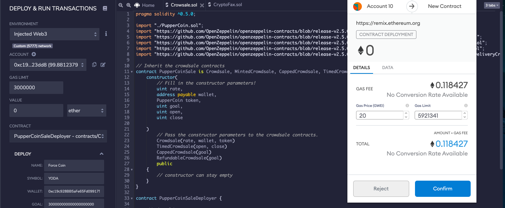
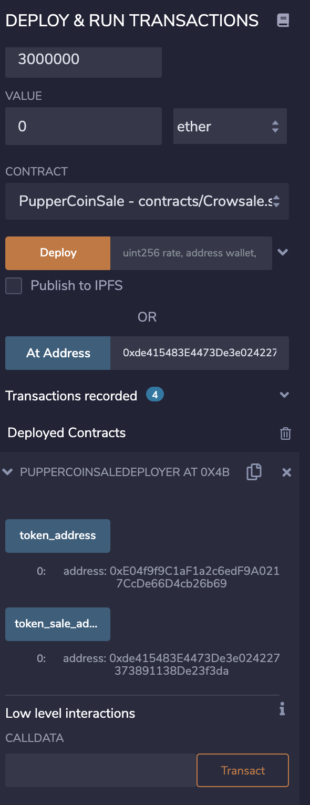
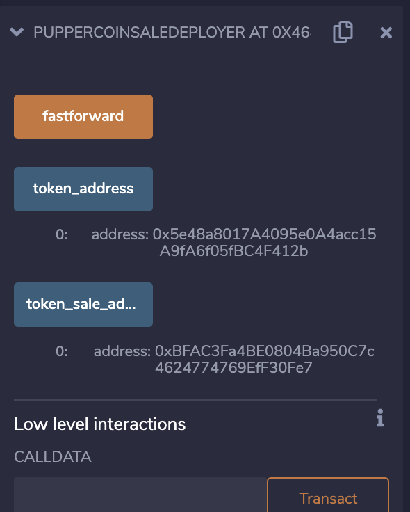
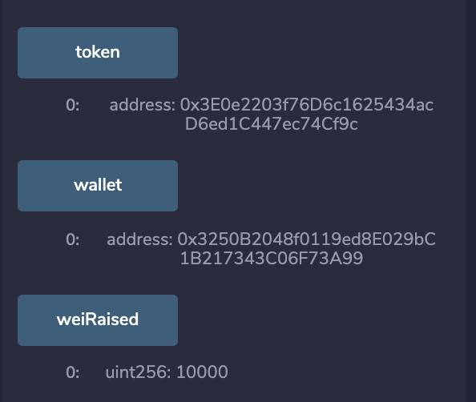

# Advanced-Solidity

## ERC20 Crowdsale 

## Background 

Your company has decided to crowdsale their PupperCoin token in order to help fund the network development.
This network will be used to track the dog breeding activity across the globe in a decentralized way, and allow humans to track the genetic trail of their pets. You have already worked with the necessary legal bodies and have the green light on creating a crowdsale open to the public. However, you are required to enable refunds if the crowdsale is successful and the goal is met, and you are only allowed to raise a maximum of 300 Ether. The crowdsale will run for 24 weeks.

Here we have created an ERC20 token that will be minted through a `Crowdsale` contract leverage from the OpenZeppelin Solidity library.

This crowdsale contract will manage the entire process, allowing users to send ETH and get back the token.
This contract will mint the tokens automatically and distribute them to buyers in one transaction.

### Designing the contracts

#### ERC20 PupperCoin

Within the [PupperCoin.sol](PupperCoin.sol) contrct we used a standard `ERC20Mintable` and `ERC20Detailed` contract, hardcoding `18` as the `decimals` parameter, and leaving the `initial_supply` parameter alone.

#### PupperCoinCrowdsale

Here the [Crowdsale.sol](Crowdsale.sol) inherits the following OpenZeppelin contracts:

* `Crowdsale`

* `MintedCrowdsale`

* `CappedCrowdsale`

* `TimedCrowdsale`

* `RefundablePostDeliveryCrowdsale`

You will need to provide parameters for all of the features of your crowdsale, such as the `name`, `symbol`, `wallet` for fundraising, `goal`, etc. Feel free to configure these parameters to your liking.

You can hardcode a `rate` of 1, to maintain parity with Ether units (1 TKN per Ether, or 1 TKNbit per wei). 

Since `RefundablePostDeliveryCrowdsale` inherits the `RefundableCrowdsale` contract, which requires a `goal` parameter, you must call the `RefundableCrowdsale` constructor from your `PupperCoinCrowdsale` constructor as well as the others. `RefundablePostDeliveryCrowdsale` does not have its own constructor, so just use the `RefundableCrowdsale` constructor that it inherits.

For the  `open` and `close` times, we use `now` and `now + 24 weeks` to set the times for the `PupperCoinCrowdsaleDeployer` contract.

#### PupperCoinCrowdsaleDeployer

Here we create the PupperCoin, create the PupperCoinSale and mont the token. 

## Testing the Crowdsale

Deploy PupperCoinSaleDeployer

Deploy PupperCoinSale

Purchase Token 

Check Cap and Balance 

Check wei raised

### Fakenow Test

### Kovan Test Net

Deploy to the Kovan Test Net

Confirm transaction on Kovan Etherscan

Deploy PupperCoinSale

Purchase Token

Confirm Transaction on Kovan Etherscan

Check Balance

Check wei raised

### Add token to MetaMask

